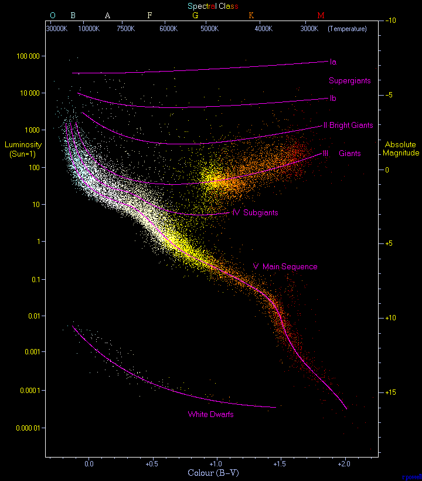

## 前

这本书，也是借借还还好几次，说是没有时间看书是假。没有静下心来是真。 最近各种事情积压，尽快的收尾，开始一个新的阶段吧。

* * *

路阻且长，戒骄戒躁，精心沉淀，厚积薄发

## 简介

- 书名：千亿个太阳
- 作者：鲁道夫·基彭哈恩
- ISBN：9787535718563

> 演出舞台是整个银河系，上场的角色是它千亿恒星和地球上的几百名天文学。 导演是自然界的规律，因而宇宙物质具有明显的聚集成球的倾向，在我们的概念中这些球就是恒星。

## 恒星漫长的生命

这部分是从人们对太阳的能源的来源的猜想引出，从 **烟煤燃烧** 到 **流行假说**，再到 **太阳可以将自身的引力释放出来** （如果太阳没有能量的输入，它将会随着时间的退役收缩，那么他的半径将会变小。每克物质会向太阳的中心靠近，即以较大的速度跌落，从而释放能量）。

后面书中引出了核聚变产能的方式。当有一颗恒星的10~20%的氢被燃烧掉，那么就会很明显的呈现出核能被耗尽的种种显现，所以太阳可以均匀的辐射时间大概有 **70亿年**。

* * *

我们肉眼可见的恒星有 7000 个，角宿一为大家所熟知，他是室女座的最亮的一颗恒星，质量是太阳的十倍，辐射比太阳强 1000 倍，那么这样的话，角宿一的寿命只有短短的几百万年。

天狼星是一个双星系统，有主序星天狼A和白矮星天狼B，由其轨迹的周期摆动发现。御夫座ζ星也是双星系统，由其亮度的周期变化发现。

## 赫罗图

赫罗图可以对恒星进行分类，书中称为对天体物理学家最有用的图。其横轴为温从高到低，纵轴为光度，从低到高。图示如下

以太阳的光度，为**1**作为纵轴的中点，y轴表示光度的倍数，从 **1/1000到1000**，太阳的表面温度为 5800℃，位于x轴的中间。比太阳更热的恒星在太阳的左边。光度更大的星在太阳的上边，反之也如此。

因为冷星的光为红色，热星的光为白色或者蓝色，所以红星位于右边。蓝白星位于左边。上边的时光度大的星，下边是光度小的星。 **推论：**一个冷天体每秒只能辐射较少的能量，而且光度又较高，所以必定是一颗很大的星，所以就在赫罗图的右上方，人们称之为红巨星或者超红巨星。御夫座ζ双星的主星，就是一颗红巨星，其体积可以容纳地球轨道。 在赫罗图的左下角，其光度较低，但是却是白星，所以其体积必然很小，所以在左下就是白矮星。天狼星的伴星 天狼B 就是一颗白矮星。

* * *

由上图可见，其中的 Main Sequence 就是我们所说的主序，有 90% 的恒星处于这条带内，这些星就是我们所说的主序星。

得到一个惊人的结果：一定质量的恒星只能存在一定的主序位置上。质量小的在主序位置下降，质量大的在主序的上端。这就是重要的**质光关系**。

### 星团

恒星是成群的形成星团。熟知的有 昂星团和毕星团。

所有的星团都占有一段共有的主序，较亮的星在向右转折的分支上。在主序上，拥有更高的质量（根据质光关系得到的是更高的光度），优雅的恒星寿命也是越短的。

**星系的年龄**因为前面得到了，质量越高的星，其寿命越短，当主序星的氢耗尽时，其会向右偏移，变成一颗红巨星，那么在主序上的这一部分就会出现断层。那么如此，如果判断一个星团的年龄的话，就可以根据主序的最左上端进行判断。那么得到 **M3>毕星团>昂星团**。

## 恒星

这里讲了恒星结构，以及恒星的内部反应原理。

镭的原子核受到了核力的约束理应不能分裂时稳定的。但是事实是这种的分裂时可以发生的。核的一部分，会在偶然间冲破强大核力的作用。人们称该效应为**隧道效应**。理解为不用爬上山顶，可以有一条隧道。

在恒星中，存在着碳循环，在这里碳便是核反应的催化剂一样的角色。过程是比较复杂的，简单写为 `C12+H->N13->C13+H->N14->O15->N15+H-He4->C12`

* * *

后面的理论指出，在没有碳氮存在的条件下也可以产生聚变反应。**质子-质子链**，氕氕成氘，氕氘成氦。四个氢核聚变成一个氦核。

在恒星中，是根据温度分别上面的两种反应的，**在1000万**度以下是 质子质子链，而以上则是以碳循环为主。

**在宇宙形成的时候，一代恒星没有碳氮元素**，主要依靠质子链进行反应，内部的氦核形成碳之后，为各代恒星提供了所需的催化元素。

## 恒星模型

恒星由元素引力和内部压力的平衡来进行支撑。恒星物质不断的进行对流，来实现能量的传递。

核聚变的过程中是可以释放出中微子的，不带电的极小粒子，基本不受任何阻挡的沿直线传播。在地球上可以使用四氯化碳进行捕捉。**一个中微子可以使一个氯原子变成氩原子**。

## 较大质量恒星

### 脉动行星

造父变星，是变星的一种，其光度会有节奏的变亮变暗，其亮度发生变化的过程，可以理解为一个活塞的阻尼振动的过程，

## 演化后期

氦闪跃指的是行星内部的氦的猛烈燃烧，当恒星中部的氢燃料耗尽的时候，恒星的中部形成了一个巨大的氦球。**光子和电子产生中微子对带走中心部分的部分能量（中微子致冷）**，使得恒星的中心的温度低于其他区域。氦就在温度最高的地方发生燃烧，由于是在高密度情况进行，所以会非常的迅猛，**形成了氦闪跃**。

## 窃取恒星的物质

大陵五，英仙座β星，**西名Algol，意思是“妖魔”**，当一个双星系统，每个恒星都小于其洛希体积以内，恒星之间不会感觉到伴星的作用。多数情况这是两颗主序星。

当其中一颗星刚好是允许的洛希体积的时候，就是大陵五，这样两星之间就有了矛盾。

## 恒星的结局

大质量恒星的**铁心灾变**。

恒星的命运要么是老老实实的成为白矮星，要么是以中子星结束。

恒星的结局就是成为致密的天体，其中的物质永远在一起。不过至此之前，会把一部分的质量抛向空中，为了新一代的恒星诞生提供了物质基础。

> 恒星几户总要变成致密天体，那么，归根到底恐怕宇宙中的一切物质都要聚缩为冷却的白矮星，中子星或者黑洞，而围绕他们死气沉沉地运转地则是僵冷地行星。看起来似乎宇宙是在走向枯燥乏味地未来。

## 恒星的诞生

气体云的塌缩，到2000度氢分子分解成原子，那么体积继续收缩，温度继续升高。

角动量守恒的定律很好的说明的自转的现象，由于不断的塌缩，就像旋转过程中突然收回腿一样，角速度会提升，所以云团越转越快，到最后就形成了我们所熟悉的一个圆盘。

## 后

> 一个想知道恒星随时间变化的天文学家可以和一只想在短暂生命中了解人类衰老过程的果蝇一样。我们置身于它的地位来想想，如果它从早到晚总在观察一个人，那么它不会发现这个人由明显的衰老。 人的寿命远比果蝇长的多，他只能看到各色的人，高矮胖瘦，他看到的只是人类中的一个瞬间的时刻，它不会知道**矮人不是永远的矮，浅皮肤的人不会变成深色，男人不会变成女人**。我们观察恒星的时候也是，我们看到的只是一个瞬间图像，看到的各个类型的恒星，比如有颗器官的星绕着天狼星运动...
